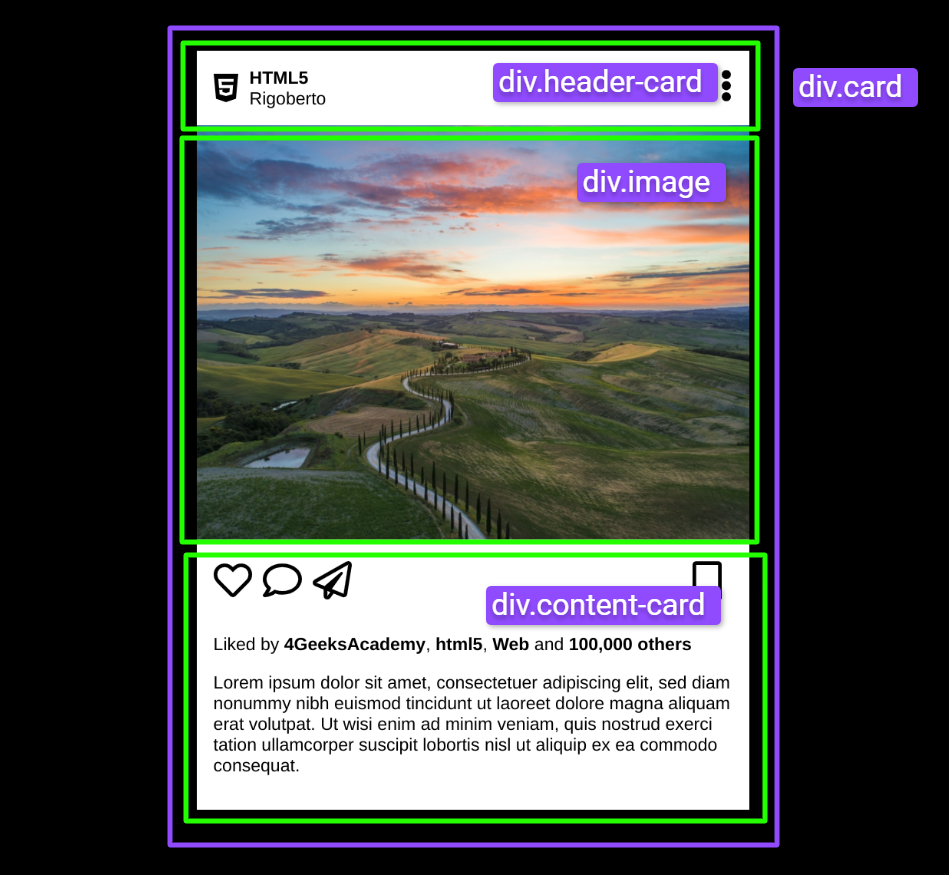

# `02` Crear la estructura principal

Antes de escribir una sola línea de código, es esencial entender completamente lo que se quiere lograr. Por ejemplo, si van a desarrollar una tarjeta de interfaz como en el ejemplo de la imagen, necesitan hacerse preguntas como:

- ¿Qué elementos va a tener la tarjeta?
- ¿Cuáles son las secciones principales?

Dividir el proyecto en pequeñas partes (como encabezado, imagen, contenido) ayuda a abordar el problema de forma más organizada.



### Instrucciones:

En este paso, vas a crear la estructura del post de Instagram utilizando etiquetas `div` para organizar las secciones. 

- Crea un contenedor `div.card` que tendrá tres secciones, tal y como lo indica la imagen:
- Encabezado (`div.header-card`): Aquí irá el avatar del usuario, su nombre y un menú de opciones.
- Image (`div.image`): Donde se mostrará la imagen principal del post.
- Cuerpo (`div.content-card`): Incluirá los íconos de interacción y la descripción del post.


### Ejemplo:

```html
<div class="card">
  <div class="header-card"></div>
  <div class="image"></div>
  <div class="content-card"></div>
</div>
```